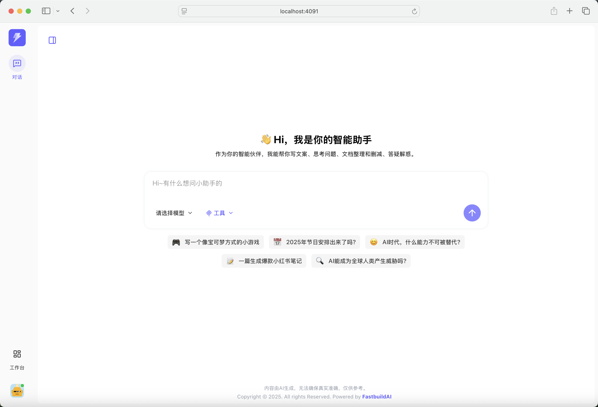
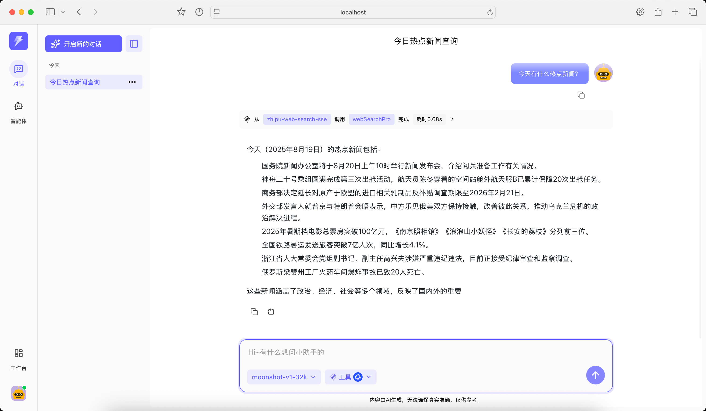
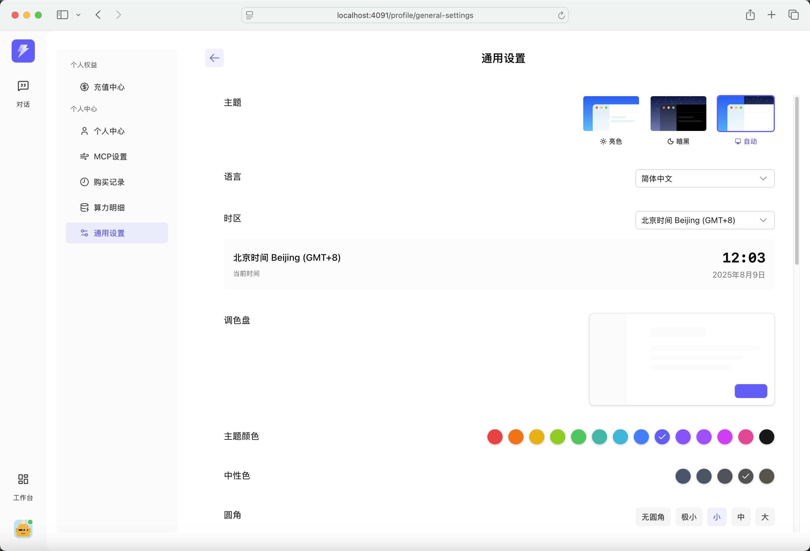
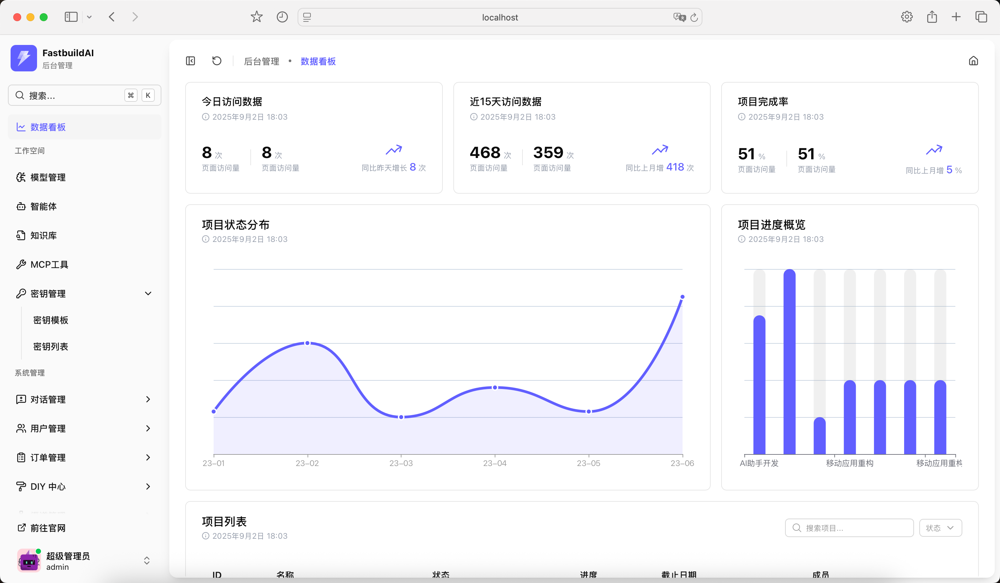
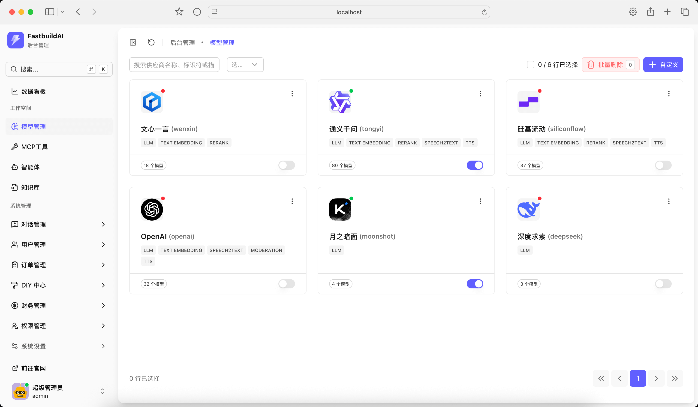
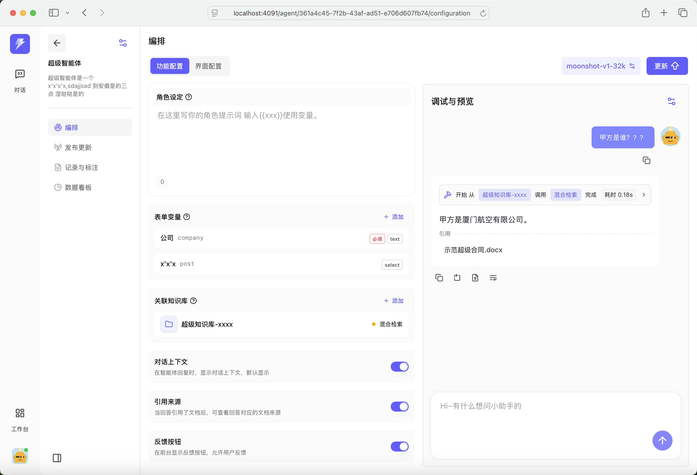
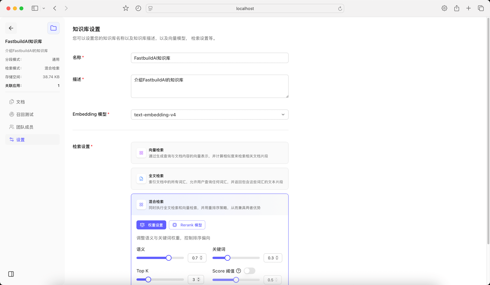
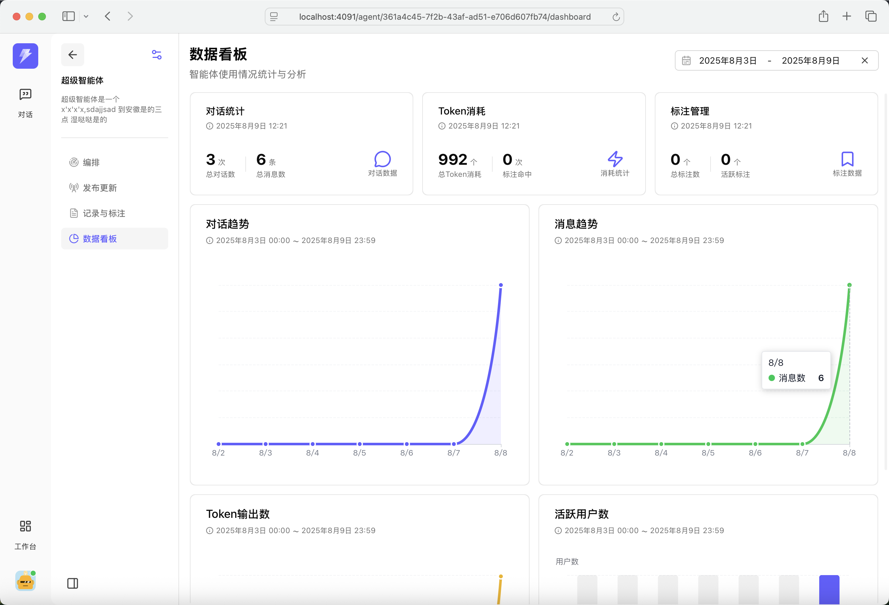

<p align="center">
  <a href="http://nestjs.com/" target="blank"></a>
</p>

<h1 align="center">FastbuildAI</h1>

<p align="center">
  Fast build your AI application
</p>

<p align="center">
  <a href="https://nestjs.com/"></a>
  <a href="https://typeorm.io/"></a>
  <a href="https://www.postgresql.org/"></a>
  <a href="https://www.typescriptlang.org/"></a>
  <a href="https://turbo.build/"></a>
  <a href="https://vuejs.org/"></a>
  <a href="https://vitejs.dev/"></a>
  <a href="https://ui.nuxt.com/"></a>
  <a href="https://nuxt.com/"></a>
</p>

<p align="center">
<a href="http://ai.fastbuildai.com/" target="_blank">Demo Online</a>｜
<a href="https://www.fastbuildai.com/">Website</a>｜
<a href="./README.zh-CN.md">中文文档</a>
</p>


## Get Started

From the project root directory, run:

```bash
# Copy the example configuration file
cp .env.production.local.example .env.production.local

# Start the application using Docker
docker compose -p fastbuildai --env-file ./.env.production.local -f ./docker/docker-compose.yml up -d
```

Wait for **2–3 minutes** until all services are up and running.

Once started, you can access the application at:

```
http://localhost:4090
```

**Default Super Admin Account**  
- **Username:** `admin`  
- **Password:** `FastbuildAI&123456`  

## Features

- ✅ **AI Chat** – Multi-model AI conversation.
- ✅ **MCP Invocation** – Supports Model Context Protocol (MCP).
- ✅ **User Recharge** – User balance and payment system.
- ✅ **Model Management** – Manage and deploy AI models.
- ✅ **Knowledge Base** – Centralized AI knowledge.
- ✅ **Intelligent Agents** – Autonomous agents for tasks.
- ⬜ **Workflow** – AI task automation.
- ⬜ **Plugin System** – Extend functionality with plugins.


## Screenshots











## Star History

[](https://www.star-history.com/#FastbuildAI/FastbuildAI&Date)

## License

[Apache License 2.0](./LICENSE)

